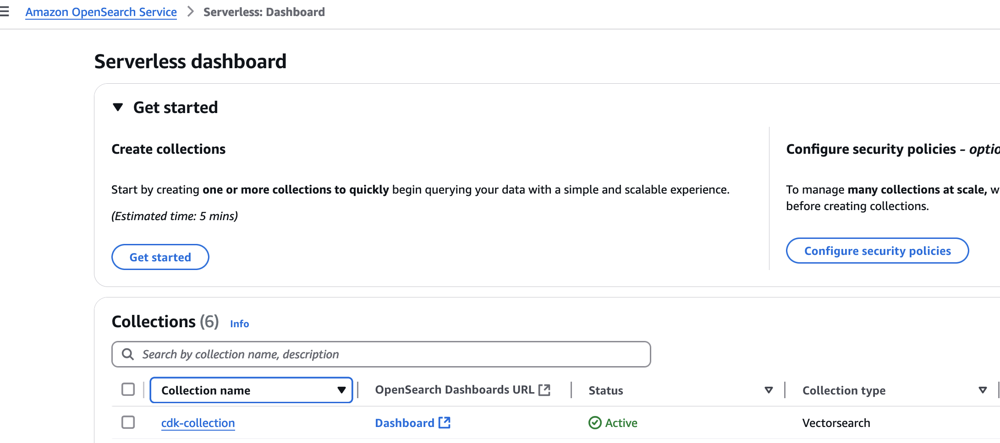
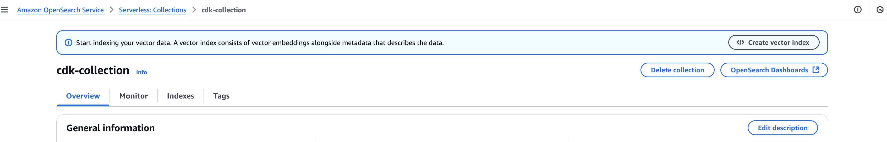
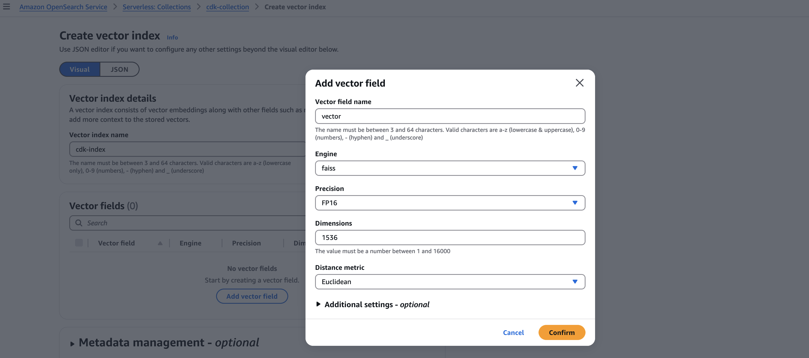

# bedrock-cdk

# CDK OpenSearch Serverless, Bedrock and Agent Integration

This CDK application deploys OpenSearch Serverless collection for vector storage, configures necessary security policies, and integrates with Amazon Bedrock and Bedrock Agent. This shows how to automate the setup of Amazon Bedrock with agents and knowledge base using CDK

This solution sets up a vector index optimized for embedding storage, an S3 bucket for document management, and a Bedrock agent that can interact with the knowledge base through natural language.

This project deploys an AWS CDK application consisting of two stacks: OpenSearch Serverless and Amazon Bedrock integration.

## Prerequisites

- [AWS CDK installed and configured](https://docs.aws.amazon.com/cdk/v2/guide/getting_started.html)
- [AWS CLI Installed](https://docs.aws.amazon.com/cli/latest/userguide/getting-started-install.html)
- [AWS CLI credentials configured](https://docs.aws.amazon.com/cli/v1/userguide/cli-chap-configure.html)


## Stack Details

### OpenSearch Stack

    Creates an OpenSearch Serverless collection
    Sets up encryption, network, and data access policies
    Creates an S3 bucket for document storage
    Creates IAM roles for Bedrock integration

### Bedrock Stack

    Creates a Knowledge Base using the OpenSearch collection
    Sets up a data source connected to the S3 bucket
    Creates a Bedrock agent with the Knowledge Base integration

### Important Notes

    The OpenSearch collection can take several minutes to become active
    The vector index must be created after the collection is active and before deploying the Bedrock stack
    The default vector dimension (1536) is set for Titan Embedding Model
    Make sure to update the CONFIG values according to your requirements
    The network policy allows public access - modify according to your security requirements


## Deployment

1. Clone the repository

2. Update `config.ts` in lib folder with required collection name, and iamUserArn with you IAM role/user ARN that has access to OpenSearch and Bedrock

```typescript
export const CONFIG = {
  collectionName: 'your-collection-name',
  indexName: 'your-index-name',
  iamUserArn: 'arn:aws:iam::YOUR_ACCOUNT_ID:user/YOUR_USER_NAME'
};
```

3. Install dependencies:

```ruby
npm install
```

4. Deploy the OpenSearch stack:

```ruby
cdk deploy opensearch-stack
```

5. After the OpenSearch stack is deployed, create the vector index.
    - Goto OpenSearch Serverless Dashboard
    - Select the collection
    - Select Create Vector Index
    - Enter Indexname as mentioned in `config.ts` . cdk-index in this case.
    - Click on Add Vector Field, add name vector and dimension as 1536 (as we are using Amazon Titan Text Embedding v1)
    - Screenshots of above steps are below

Select the collection


Create Vector Index


Add Vector Field



6. Deploy the Bedrock stack:

```ruby
cdk deploy bedrock-stack
```

## Clean Up

1. [Empty the created S3 bucket](https://docs.aws.amazon.com/AmazonS3/latest/userguide/DeletingObjects.html)

2. Run below commands

```ruby
cdk destroy bedrock-stack
cdk destroy opensearch-stack
```

OR

```ruby
cdk destroy --all
```

## Contributing

## License
This library is licensed under the MIT-0 License. See the LICENSE file.

